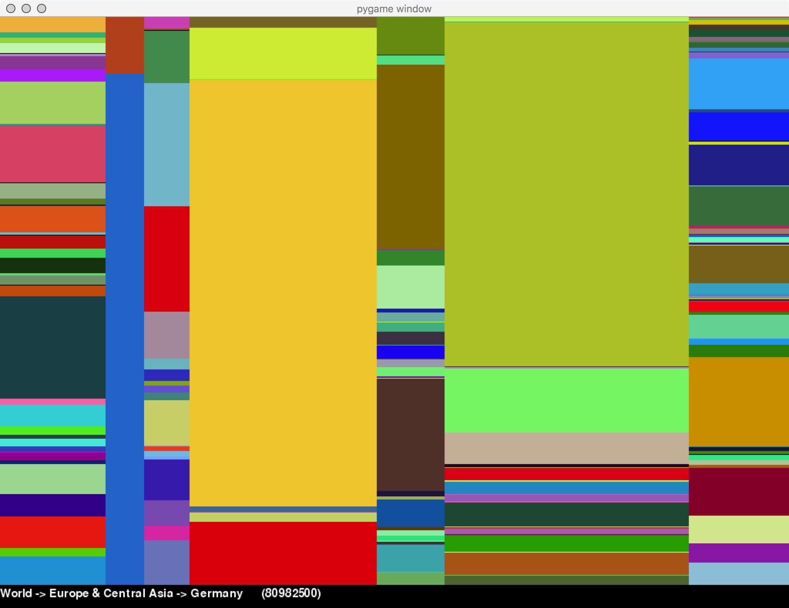
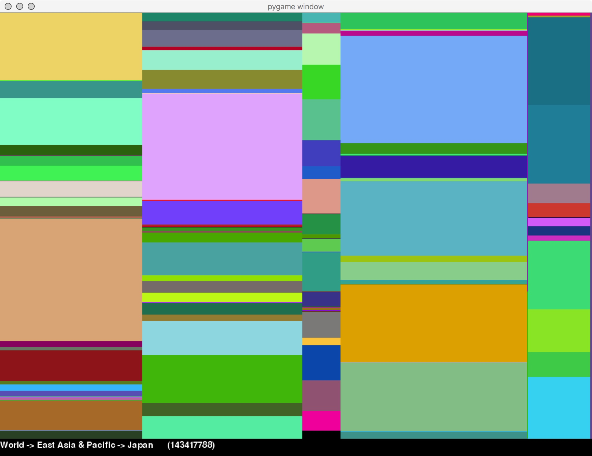
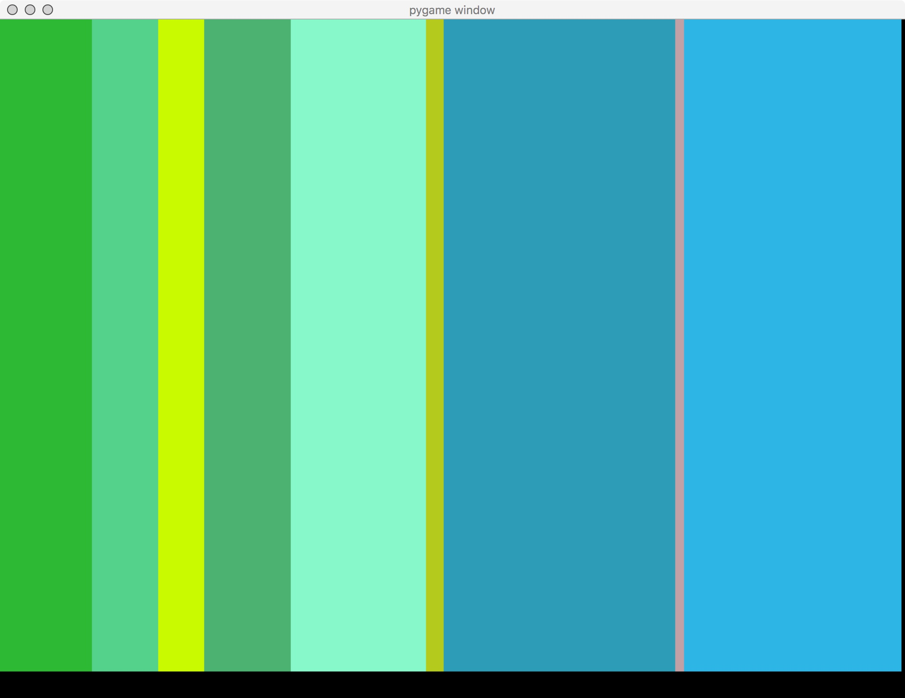

# Treemap
A treemap to visualize world population ratio and play with it! 

- Good recursion and information retrieval practice with simple user events.

# Control
- Left click to select a country, right click to delete country from map.
- On a selected country, press the up/down arrow to increase/decrease population.

# Screenshots
Display country info and modify population data.

Project designed by professors Diane Horton and David Liu,
Department of Computer Science, University of Toronto.
